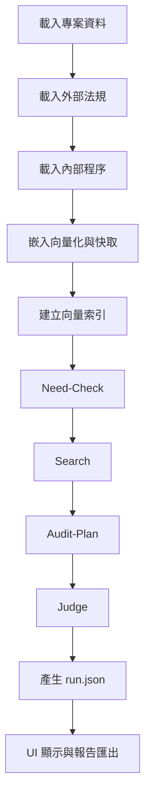

# 大綱

1. [簡介](#1-簡介)
2. [主要功能](#2-主要功能)
3. [快速開始](#3-快速開始)

   1. [選項一：使用預建執行檔（推薦）](#31-選項一使用預建執行檔推薦)
   2. [選項二：原始碼開發與環境設定](#32-選項二原始碼開發與環境設定)
4. [使用 PyInstaller 打包](#4-使用-pyinstaller-打包)
5. [範例專案](#5-範例專案)
6. [設定檔與配置](#6-設定檔與配置)
7. [基本操作流程](#7-基本操作流程)
8. [報告匯出](#8-報告匯出)
9. [測試](#9-測試)
10. [常見問題](#10-常見問題)
11. [專案結構](#11-專案結構)
12. [快取機制](#12-快取機制)
13. [Pipeline 流程](#13-pipeline-流程)
14. [PyInstaller 打包 tiktoken 完整指引](#14-pyinstaller-打包-tiktoken-完整指引)
15. [參考連結](#15-參考連結)

---

## 1. 簡介

Regulens-AI 是一款桌面應用程式，透過 Retrieval Augmented Generation (RAG) 流程協助使用者進行合規性分析。它可讓使用者將各類外部法規、控制項（Controls）、程序（Procedures）文件與證據檔案集中管理，並自動產生合規性評估報告。

## 2. 主要功能

1. **專案化工作流程**：將不同合規性評估以專案形式管理。
2. **兩欄式檔案輸入**：依序定義「控制項（Controls）」、「程序（Procedures）」檔案路徑。
3. **自動化 RAG Pipeline**：自動處理文件檢索與生成合規性洞察。
4. **本地向量庫**：採用 FAISS 建立文件嵌入向量庫，加速相似度搜尋。
5. **LLM 整合**：呼叫大型語言模型 (如 OpenAI GPT 系列) 執行評估與判斷。
6. **CSV 報告**：自動產生詳細的合規報告，可匯出為 CSV。
7. **內建範例專案**：首次啟動時自動建立範例專案，協助用戶快速上手。
8. **可配置設定**：在設定對話框中調整 OpenAI API 金鑰、嵌入模型、LLM 模型及其他參數。
9. **主題支援**：提供 Light、Dark、Dracula 介面主題。
10. **多語言介面**：支援繁體中文 (zh) 與英文 (en)。

## 3. 快速開始

### 3.1 選項一：使用預建執行檔（推薦）

1. 於 [發布頁面](#)下載最新版本
2. 解壓縮 ZIP 檔至指定目錄
3. 直接執行 `RegulensAI.exe`，無需安裝！

### 3.2 選項二：原始碼開發與環境設定

```bash
# 建立並啟用虛擬環境
python -m venv .venv
# macOS / Linux
source .venv/bin/activate
# Windows
.\.venv\Scripts\activate

# 安裝相依套件
pip install -r requirements.txt
```

1. 首次啟動時，程式會自動建立範例專案。
2. 開啟「設定」(File > Settings...)，填入 **OpenAI API Key**。
3. 調整 **Embedding Model**、**LLM Model** 及其他參數。
4. 執行應用程式：

   ```bash
   # 方式一：entry point 腳本
   python run_app.py

   # 方式二：模組執行
   python -m app.main
   ```

## 4. 使用 PyInstaller 打包

1. 安裝 PyInstaller：

   ```bash
   pip install pyinstaller
   pip install -r requirements.txt
   ```
2. 使用範本腳本打包（推薦）：

   ```bash
   # Windows
   build.bat
   # Linux / macOS
   chmod +x build.sh
   ./build.sh
   ```
3. 手動使用 spec 檔：

   ```bash
   pyinstaller --clean regulens-ai.spec
   ```

**輸出結果**：

* `dist/RegulensAI.exe`
* `build/` 目錄（可刪除）
* `regulens-ai.spec`

## 5. 範例專案

1. **符合規範 Demo（Sample 2）**
   - 外部法規：`external_regulations/external.json`（資通安全管理辦法，含事件分級與專責人員配置要求）
   - 程序（Procedures）：`procedures/internal.txt`
   - 內容特色：程序（Procedures）完整對應外部法規要求，包含四級事件分級、應變流程，以及明確規範「至少配置兩名具專業資格之資安專責人員」等細節，完全符合法規規範。

2. **不符合規範 Demo（Sample 3）**
   - 外部法規：同上
   - 程序（Procedures）：`procedures/internal.txt`
   - 內容特色：程序（Procedures）內容有缺漏，例如僅配置一名資安專責人員，且部分事件分級與應變流程未完整覆蓋外部法規要求，系統將自動判斷為「不符合」並顯示合規缺口。

## 6. 設定檔與配置

1. **設定檔路徑**：

   * Windows: `%APPDATA%\regulens-ai\settings.json`
   * macOS: `~/Library/Application Support/regulens-ai/settings.json`
   * Linux: `~/.config/regulens-ai/settings.json`
2. **主要選項**：

   1. OpenAI API Key (必要)
   2. 主題 (light / dark / dracula / system)
   3. 語言 (zh / en)
   4. 嵌入模型 (預設 `text-embedding-3-large`)
   5. LLM 模型 (預設 `gpt-4o`)

## 7. 基本操作流程

1. 啟動程式（執行 EXE 或 `python -m run_app.py`）。
2. 使用範例專案快速體驗。
3. 建立新專案：

   1. 點選「新增專案」
   2. 選擇 `external.json` 與 `internal.txt`
   3. 點擊「開始比對」或「執行分析」
4. 分析完成後：

   1. 檢視合規性結果、稽核計畫與詳細報告
   2. 匯出 Markdown 或 PDF 報告
5. 於「設定」中切換主題、語言與 API 金鑰。

## 8. 報告匯出

1. 支援匯出：CSV。
2. 報告內容：合規性摘要、稽核計畫、詳細比對紀錄。
3. 原始結果檔：`run.json`。

## 9. 測試

執行測試套件：

```bash
pytest
```

## 10. 常見問題

1. **OpenAI API Key 無效？** 確認金鑰與餘額。
2. **cache 目錄能否刪除？** 可刪除，系統會自動重建。
3. **找不到 `run.json`？** 確認 `sample_data` 已正確複製。
4. **如何切換語言？** 於「設定」切換後重啟。
5. **如何切換主題？** 同上，立即生效。
6. **匯出格式？** CSV。
7. **自訂範例資料？** 新增專案時選擇自定檔案。
8. **Unknown encoding cl100k_base？** 參考「PyInstaller 打包 tiktoken 完整指引」。

## 11. 專案結構

```plain
app/
assets/
config_default.yaml
docs/
tests/
sample_data/
run_app.py
regulens-ai.spec
build.bat
build.sh
requirements.txt
~/.config/.../cache
~/.config/.../projects.json
```

## 12. 快取機制

1. **快取目錄**：

   * Windows: `%APPDATA%/regulens-ai/cache/`
   * macOS: `~/Library/Application Support/regulens-ai/cache/`
   * Linux: `~/.local/share/regulens-ai/cache/`
2. **快取內容**：向量嵌入、FAISS 索引、LLM 回應快取、Pipeline 臨時檔
3. **管理**：自動檢查並載入快取，必要時重新計算。

## 13. Pipeline 流程



## 14. PyInstaller 打包 tiktoken 完整指引

1. **問題現象**：Unknown encoding 'cl100k_base'.
2. **原因**：tiktoken plugin 未被打包。
3. **解決**：

   * 檢查並更新 tiktoken。
   * 在 spec 加入 hidden-imports: `tiktoken_ext`, `tiktoken_ext.openai_public`。
   * CLI 加上 `--hidden-import` 與 `--collect-data`。
4. **驗證**：執行 exe，確認 `Plugins found: ['tiktoken_ext.openai_public']`。

## 15. 參考連結

* tiktoken Issue #89
* tiktoken Issue #221
* Knowledge Oasis: pyinstaller-tiktoken
* StackOverflow: Unknown Encoding TikToken Error
