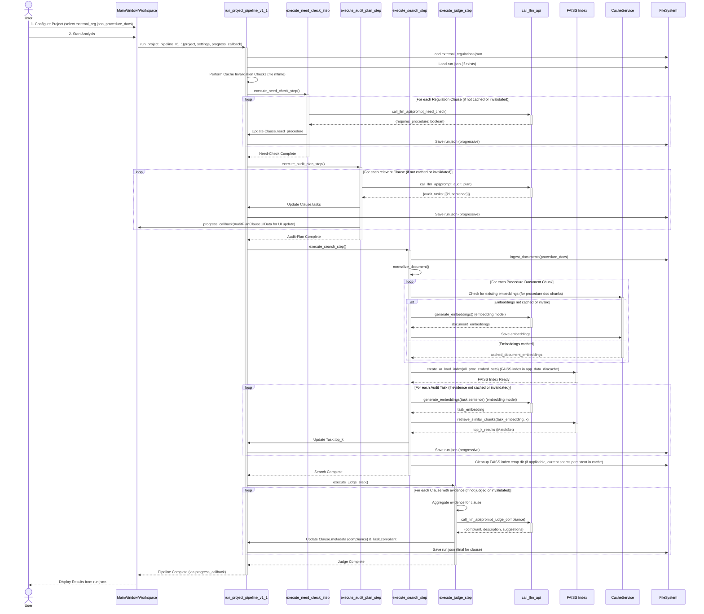

# Regulens-AI

> **An intelligent desktop application** that assists users in **compliance analysis** through a **Retrieval Augmented Generation (RAG)** workflow. It allows users to centralize various external regulations, controls, and procedure documents, and automatically generate compliance assessment reports.

---

## Authors

*   [Jerry Hung](https://github.com/JerryHung1030)
*   [Ken Su](https://github.com/ken22i)
*   [SJ](https://github.com/shih1999)

---

## Table of Contents

1.  [✨ Features](#-features)
2.  [🗺️ Architecture Overview](#️-architecture-overview)
3.  [🚀 Quick Start](#-quick-start)
    *   [Option 1: Using Pre-built Executable (Recommended)](#option-1-using-pre-built-executable-recommended)
    *   [Option 2: Source Code Development & Environment Setup](#option-2-source-code-development--environment-setup)
4.  [📂 Project Structure](#-project-structure)
5.  [⚙️ Configuration](#️-configuration)
    *   [Key Configuration Options (Managed via Settings Dialog)](#key-configuration-options-managed-via-settings-dialog)
    *   [Cache Mechanism](#cache-mechanism)
6.  [🛠️ Basic Operation Flow](#️-basic-operation-flow)
7.  [📦 Packaging with PyInstaller](#-packaging-with-pyinstaller)
8.  [📋 Sample Projects](#-sample-projects)
9.  [🚧 Development Status & Roadmap](#-development-status--roadmap)
10. [🧪 Testing](#-testing)
11. [❓ FAQ](#-faq)
12. [🤝 Contributing](#-contributing)
13. [📄 License](#-license)
14. [🔗 References](#-references)

---

## ✨ Features

*   **Project-Based Workflow:** Manage different compliance assessments as distinct projects (`CompareProject` model).
*   **Flexible Document Input:** Supports external regulations via JSON (`external_regulations.json`) and internal procedures from text files (`internal.txt`).
*   **Automated RAG Pipeline (`pipeline_v1_1.py`):**
    *   **Need-Check:** LLM-powered determination (`execute_need_check_step`) of whether an external regulation clause requires corresponding internal procedures.
    *   **Audit-Plan Generation:** LLM-driven creation (`execute_audit_plan_step`) of specific audit tasks (search queries) for each relevant regulation clause.
    *   **Evidence Retrieval (Search):**
        *   Ingestion (`ingest_documents`) and normalization (`normalize_document`) of procedure documents.
        *   Efficient text embedding (`generate_embeddings`) using configurable models (e.g., OpenAI `text-embedding-3-large`) with `CacheService`.
        *   Local, persistent FAISS vector store (`create_or_load_index`) for procedure document chunks, stored in the application's data directory.
        *   Semantic search (`retrieve_similar_chunks`) to find relevant procedure excerpts for each audit task.
    *   **Compliance Judgment:** LLM-based assessment (`execute_judge_step`) of compliance for each regulation clause based on aggregated retrieved evidence, providing a boolean outcome, descriptive reasoning, and improvement suggestions.
*   **Comprehensive Data Management:** All project inputs, intermediate results, and final judgments are stored in a structured `run.json` file per project (`ProjectRunData` model).
*   **Progressive Saving:** Pipeline progress is saved incrementally to `run.json`, allowing resumption or review of partial results.
*   **Configurable LLM & Embedding Models:** Users can specify OpenAI API keys and choose different LLM models (e.g., `gpt-4o`, `gpt-3.5-turbo`) and embedding models via a settings dialog (`Settings` class, `config_default.yaml`).
*   **User-Friendly GUI (PySide6):**
    *   Intuitive interface (`MainWindow`, `Workspace`) for project management, configuration, and viewing results.
    *   Dedicated views for project editing (`ProjectEditor`), results display (`ResultsViewer`), and an introductory guide (`IntroPage`).
    *   Real-time progress updates during analysis (`progress_callback`).
*   **Theme Support:** Light, Dark, Dracula, and System-default themes (`ThemeManager`).
*   **Multi-Language Interface:** Supports Traditional Chinese (zh) and English (en) (`Translator` class).
*   **Built-in Sample Projects:** Facilitates quick understanding and onboarding.
*   **CSV Reporting:** Export detailed compliance reports.
*   **Robust Caching:** Caches embeddings and LLM responses to accelerate subsequent runs and reduce API calls. Managed by `CacheService` and file modification time checks for invalidation.

---

## 🗺️ Architecture Overview

Regulens-AI processes compliance documents through a multi-stage pipeline. The user interacts with the GUI to define project parameters and initiate analysis. The Pipeline Orchestrator then manages the flow of data through several analytical steps, leveraging Large Language Models (LLMs), a local vector store (FAISS), and caching mechanisms to produce a compliance report.



**Brief Workflow Explanation:**

1.  **Project Setup (User & GUI):** The user defines a project in the GUI, specifying paths to external regulations (JSON) and internal procedure documents (TXT).
2.  **Initiation (GUI to Pipeline):** On starting analysis, the GUI invokes the `PipelineOrchestrator` (`run_project_pipeline_v1_1`) with project details and settings.
3.  **Data Loading & Cache Check (Pipeline):** The orchestrator loads the external regulations and any existing `run.json` (containing previous results). It checks file modification times to invalidate outdated cached results.
4.  **Need-Check (Pipeline & LLM):** For each regulation clause, this step uses an LLM to determine if internal procedures are required. Results are saved to `run.json`.
5.  **Audit-Plan (Pipeline & LLM):** For clauses needing procedures, an LLM generates specific audit tasks (essentially, focused search queries). Tasks are saved to `run.json`. The GUI is updated with these tasks.
6.  **Search (Pipeline, Cache, VectorStore, LLM for embeddings):**
    *   Internal procedure documents are ingested, normalized, and broken into chunks.
    *   Embeddings are generated for these chunks (using an embedding model via LLMService or similar) and cached by `CacheService`.
    *   A FAISS vector index is built from these embeddings and stored locally.
    *   For each audit task, its sentence is embedded, and the FAISS index is queried to find the most relevant procedure chunks (`top_k` results). These findings are saved to `run.json`.
7.  **Judge (Pipeline & LLM):** For each regulation clause, the retrieved evidence (top\_k procedure chunks from all its tasks) is aggregated and presented to an LLM. The LLM assesses whether the evidence demonstrates documented compliance, providing a boolean outcome, a textual description, and improvement suggestions. These judgments are saved to `run.json`.
8.  **Results Display (Pipeline to GUI):** The pipeline signals completion. The GUI then loads the final `run.json` data to display the comprehensive compliance assessment report to the user.

---

## 🚀 Quick Start

### Option 1: Using Pre-built Executable (Recommended)

1.  Download the latest version from the [Releases Page](#) (Note: Link to be updated by project maintainers).
2.  Extract the ZIP file to your desired directory.
3.  Run `RegulensAI.exe` directly – no installation required!

### Option 2: Source Code Development & Environment Setup

1.  **Clone the repository:**
    ```bash
    git clone <repository_url> # Replace <repository_url> with actual URL
    cd regulens-ai 
    ```
2.  **Create and activate a virtual environment:**
    ```bash
    python -m venv .venv
    # macOS / Linux
    source .venv/bin/activate
    # Windows
    .\.venv\Scripts\activate
    ```
3.  **Install dependencies:**
    ```bash
    pip install -r requirements.txt
    ```
4.  **Initial Setup:**
    *   On first launch, the application will automatically create sample projects.
    *   Open "Settings" (File > Settings...) and enter your **OpenAI API Key**.
    *   Adjust **Embedding Model**, **LLM Model**, and other parameters as needed.
5.  **Run the application:**
    ```bash
    # Option A: Using the entry point script
    python run_app.py

    # Option B: Running as a module
    python -m app.main
    ```

---

## 📂 Project Structure

The project is organized to separate core logic, UI components, data models, and assets:

```text
regulens-ai/
├── .github/                    # GitHub Actions workflows (e.g., CI if configured)
├── app/                        # Main application source code (Python modules)
│   ├── __init__.py
│   ├── app_paths.py            # Manages application-specific file paths (cache, settings)
│   ├── i18n.py                 # Internationalization setup
│   ├── logger.py               # Logging configuration (Loguru)
│   ├── main.py                 # Main application entry point for GUI (initializes QApplication, MainWindow)
│   ├── mainwindow.py           # Defines the main application window structure and core interactions
│   ├── models/                 # Pydantic models for data structures
│   │   ├── __init__.py
│   │   ├── assessments.py      # (Likely related to assessment data, if used)
│   │   ├── docs.py             # Models for documents (ExternalRegulationClause, AuditTask, RawDoc, NormDoc, EmbedSet)
│   │   ├── project.py          # Defines CompareProject (project configuration)
│   │   ├── run_data.py         # Defines ProjectRunData (stores all results for a project run)
│   │   └── settings.py         # Pydantic model for application settings
│   ├── pipeline/               # Core RAG pipeline logic
│   │   ├── __init__.py
│   │   ├── cache.py            # CacheService for embeddings and LLM responses
│   │   ├── embed.py            # Embedding generation logic
│   │   ├── index.py            # FAISS index creation and loading
│   │   ├── ingestion.py        # Document ingestion (reading files)
│   │   ├── llm_utils.py        # Utilities for interacting with LLMs (call_llm_api)
│   │   ├── normalize.py        # Text normalization and chunking
│   │   ├── pipeline_v1_1.py    # Main pipeline orchestrator (run_project_pipeline_v1_1)
│   │   └── retrieve.py         # Logic for retrieving chunks from FAISS index
│   ├── pipeline_settings.py    # Pydantic model for pipeline-specific settings
│   ├── settings.py             # Application settings management (loading/saving settings.json)
│   ├── settings_dialog.py      # UI for the settings dialog
│   ├── stores/                 # Data persistence for application state
│   │   └── project_store.py    # Manages the list of user projects (projects.json)
│   ├── translator.py           # Handles language translation
│   ├── utils/                  # Shared utility modules
│   │   ├── font_manager.py
│   │   ├── icon_manager.py
│   │   ├── theme_manager.py
│   │   └── windows_taskbar_advanced.py # Windows-specific taskbar features
│   ├── views/                  # More complex view components
│   │   └── workspace.py        # Main workspace view, likely hosts project editor and results
│   └── widgets/                # Reusable UI widgets (PySide6)
│       ├── intro_page.py       # Welcome/Introduction screen
│       ├── progress_panel.py   # Panel for displaying progress
│       ├── project_editor.py   # UI for editing project details
│       ├── results_viewer.py   # UI for displaying analysis results
│       └── sidebar.py          # Sidebar for navigation (e.g., project list)
│
├── assets/                     # Static assets used by the application
│   ├── fonts/                  # Custom fonts
│   ├── icons/                  # Application icons
│   └── themes/                 # QSS stylesheets and color definitions for themes (dark.json, light.json, etc.)
│
├── sample_data/                # Sample projects for demonstration
│   ├── sampleX_.../
│       ├── external_regulations/external.json
│       └── procedures/internal.txt
│
├── tests/                      # PyTest test suites
│
├── .gitignore                  # Specifies intentionally untracked files for Git
├── build.bat                   # Windows build script for PyInstaller
├── build.sh                    # Linux/macOS build script for PyInstaller
├── config_default.yaml         # Default application configuration values
├── LICENSE                     # (To be added by user if different from template)
├── README.md                   # This document
├── requirements.txt            # Python package dependencies
├── regulens-ai.spec            # PyInstaller specification file for building executable
└── run_app.py                  # Convenience script to run the application (imports and calls app.main)
```

*User-specific data (managed by `app_paths.py`):*
*   **Settings & Project List:**
    *   Windows: `%APPDATA%\regulens-ai\` (contains `settings.json`, `projects.json`)
    *   macOS: `~/Library/Application Support/regulens-ai/`
    *   Linux: `~/.config/regulens-ai/`
*   **Cache (Embeddings, FAISS indexes, LLM responses):**
    *   Windows: `%APPDATA%\regulens-ai\cache\`
    *   macOS: `~/Library/Application Support/regulens-ai/cache\`
    *   Linux: `~/.local/share/regulens-ai/cache/`
*   **Project-specific `run.json` files:** Stored within each project's directory, as defined when the project is created/selected.

---

## ⚙️ Configuration

The application uses a default configuration file (`config_default.yaml`) for baseline settings and a user-specific `settings.json` file for overrides and user preferences. Project configurations are stored in `projects.json` and individual project results in `run.json` files within project directories.

1.  **Default Configuration (`config_default.yaml`):**
    *   Located in the project root.
    *   Contains default values for LLM models, embedding models, UI settings, etc.
    *   Serves as a fallback if user settings are missing or incomplete.

2.  **User Settings (`settings.json`):**
    *   Stores user-specific configurations like API keys, selected models, theme, and language.
    *   Managed via the "Settings" dialog in the application.
    *   Path (managed by `app_paths.py`):
        *   Windows: `%APPDATA%\regulens-ai\settings.json`
        *   macOS: `~/Library/Application Support/regulens-ai\settings.json`
        *   Linux: `~/.config/regulens-ai\settings.json`

### Key Configuration Options (Managed via Settings Dialog):

*   **OpenAI API Key:** (Required) Your personal API key for accessing OpenAI models.
*   **Theme:** Interface theme (Light, Dark, Dracula, System).
*   **Language:** Application language (English `en`, Traditional Chinese `zh`).
*   **Embedding Model:** Model for generating text embeddings (e.g., `text-embedding-3-large`, `text-embedding-ada-002`).
*   **LLM Models:**
    *   **Need-Check Model:** LLM used for the Need-Check step.
    *   **Audit-Plan Model:** LLM used for generating audit tasks.
    *   **Judge Model:** LLM used for the final compliance judgment.
    *   (Defaults like `gpt-4o` or `gpt-3.5-turbo` can be set in `config_default.yaml` and overridden by user).
*   **Audit Retrieval Top-K:** Number of relevant procedure chunks to retrieve for each audit task.

### Cache Mechanism:

*   **Cache Directory** (managed by `app_paths.py` and `CacheService`):
    *   Windows: `%APPDATA%\regulens-ai\cache\`
    *   macOS: `~/Library/Application Support/regulens-ai\cache\`
    *   Linux: `~/.local/share/regulens-ai\cache\`
*   **Cached Content:**
    *   **Vector Embeddings:** Embeddings for procedure document chunks are cached to avoid re-computation.
    *   **FAISS Indexes:** The generated FAISS index for procedure documents is stored persistently within the project's cache directory or a global cache for faster loading. The current implementation in `pipeline_v1_1.py` suggests a project-specific hash for the FAISS index path under `app_data_dir/cache/faiss_index/`.
    *   **LLM Responses:** Responses from LLM calls (Need-Check, Audit-Plan, Judge) can be cached to avoid repeated API calls for the same input.
*   **Management:** The application uses `CacheService` and checks file modification timestamps of source documents to invalidate and refresh cache entries when necessary. The cache directory can be manually deleted; the system will rebuild it.

---

## 🛠️ Basic Operation Flow

1.  **Launch Application:** Run `RegulensAI.exe` or use `python run_app.py` / `python -m app.main` from source. The `IntroPage` might be shown first.
2.  **Manage Projects (Sidebar & Workspace):**
    *   The sidebar lists existing projects. Select a project to load it into the `Workspace`.
    *   Create a new project using a "New Project" button/action.
3.  **Configure a Project (`ProjectEditor`):**
    *   For a new or existing project, define:
        *   Project Name.
        *   Path to "External Regulations" JSON file.
        *   Path(s) to "Internal Procedures" document(s) (TXT files).
4.  **Run Analysis (Workspace):**
    *   With a project loaded and configured, click an "Analyze" or "Run Pipeline" button.
    *   The `ProgressPanel` will show the status of the ongoing RAG pipeline steps.
5.  **Review Results (`ResultsViewer`):**
    *   Once the pipeline completes, the `ResultsViewer` displays:
        *   Compliance status for each external regulation clause.
        *   Generated audit tasks.
        *   Retrieved evidence snippets from procedure documents.
        *   LLM's compliance descriptions and improvement suggestions.
6.  **Export Report:**
    *   Use an "Export" function to save the structured compliance report as a CSV file.
    *   The detailed raw output of the analysis is also available in the `run.json` file located in the project's specific data directory.
7.  **Adjust Settings (`SettingsDialog`):**
    *   Access File > Settings... to configure API keys, LLM/embedding models, UI theme, and language. Some settings may require an application restart.

---

## 📦 Packaging with PyInstaller

To create a standalone executable for distribution:

1.  **Ensure Prerequisites:**
    *   Python environment with all dependencies from `requirements.txt` installed.
    *   PyInstaller installed (`pip install pyinstaller`).
2.  **Use Build Scripts (Recommended):**
    *   **Windows:** Execute `build.bat` from the command line.
    *   **Linux / macOS:** Make the script executable (`chmod +x build.sh`) and then run `./build.sh`.
    These scripts typically invoke PyInstaller with the `regulens-ai.spec` file.
3.  **Manual Build (using the .spec file):**
    ```bash
    pyinstaller --clean regulens-ai.spec
    ```
    The `regulens-ai.spec` file is pre-configured to include necessary data files (like assets) and handle hidden imports, especially for libraries like `tiktoken`.

**Output:**
*   The distributable application will be located in the `dist/` directory (e.g., `dist/RegulensAI` or `dist/RegulensAI.exe`).
*   The `build/` directory contains intermediate files and can be deleted after a successful build.

**Important Note for `tiktoken`:**
The "Unknown encoding cl100k_base" error during runtime of a packaged application commonly occurs if `tiktoken`'s necessary encoding files are not included. The `regulens-ai.spec` file should have entries like:
```python
# In .spec file analysis section:
# hiddenimports=['tiktoken_ext.openai_public', 'tiktoken_ext.common'],
# datas=[('path/to/your/venv/Lib/site-packages/tiktoken/py.typed', 'tiktoken'), 
#        ('path/to/your/venv/Lib/site-packages/tiktoken_ext', 'tiktoken_ext')] 
# Note: Actual paths for `datas` might need to be dynamically determined or correctly set in the .spec file.
# The provided build scripts and .spec file aim to manage these details.
```
The provided build scripts and `.spec` file aim to manage these details.

---

## 📋 Sample Projects

The application includes sample projects (located in `sample_data/`) to help users quickly understand its functionality:

1.  **Compliant Demo (e.g., `sample_data/sample2_符合規範Demo/`)**
    *   **External Regulations:** Contains rules like specific IT security management practices, incident classification levels, and requirements for dedicated cybersecurity personnel.
    *   **Internal Procedures:** This document fully aligns with the external regulations, detailing corresponding incident response processes, staffing commitments (e.g., "at least two professionally qualified cybersecurity personnel"), etc.
    *   **Expected Outcome:** Regulens-AI should analyze these and determine a "Compliant" status, showing strong alignment between regulations and procedures.

2.  **Non-Compliant Demo (e.g., `sample_data/sample3_不符合規範Demo/`)**
    *   **External Regulations:** Same as the compliant demo.
    *   **Internal Procedures:** This document exhibits gaps when compared to the regulations. For instance, it might only allocate one cybersecurity staff member where regulations require more, or its incident classification might not cover all mandated levels.
    *   **Expected Outcome:** Regulens-AI should flag these as "Non-Compliant" (or partially compliant) and highlight the specific discrepancies and areas for improvement in the internal procedures.

---

## 🚧 Development Status & Roadmap

**Status: Beta** (Project maintainers should update this based on current maturity)

The core RAG pipeline for compliance analysis is implemented and functional. The PySide6 GUI provides essential project management, configuration options, and results visualization. Key features include local FAISS vector storage, configurable OpenAI model integration, and comprehensive data management via `run.json`.

### ✅ Completed

*   Core RAG pipeline: Need-Check, Audit-Plan Generation, Evidence Retrieval (Embedding & FAISS Search), Compliance Judgment.
*   Project-based workflow with persistence (`CompareProject`, `ProjectRunData`, `project_store.py`).
*   Loading external regulations (JSON) and internal procedures (TXT).
*   Local FAISS vector store for semantic search of procedure documents.
*   Integration with OpenAI for LLM tasks and embeddings.
*   CSV and `run.json` export for analysis results.
*   Automatic creation of sample projects for new users.
*   User-configurable settings for API keys, models, theme, and language (`settings.json`, `SettingsDialog`).
*   Robust caching for embeddings and LLM responses (`CacheService`).
*   PySide6 GUI: `MainWindow`, `IntroPage`, `Workspace` (with `ProjectEditor`, `ResultsViewer`, `Sidebar`), `ProgressPanel`.
*   Theming (Light, Dark, Dracula, System) and Internationalization (en, zh).
*   PyInstaller packaging scripts and `.spec` file for creating distributables.

### 🛠️ In Progress / 🗓️ What's Next

*(Project maintainers to update with current development activities and future plans)*

*   **Enhanced Error Handling:** More granular error reporting and recovery within the pipeline and GUI.
*   **Broader Document Format Support:** Allow ingestion of other document types (e.g., .docx, .pdf) for internal procedures.
*   **Advanced Chunking Strategies:** Implement more sophisticated text chunking methods for better context in embeddings.
*   **Offline Model Support:** Explore integration of local/open-source LLMs and embedding models (e.g., via llama.cpp, Sentence Transformers).
*   **Batch Processing:** Ability to run analysis on multiple projects or documents in batch mode.
*   **Improved Visualization:** More interactive ways to explore relationships between regulations, tasks, and evidence.
*   **User Authentication & Role Management:** (If applicable for future multi-user versions).
*   **Comprehensive Test Coverage:** Expand unit and integration tests for all components.

---

## ❓ FAQ

1.  **Invalid OpenAI API Key?**
    *   Double-check that the API key entered in File > Settings... is correct and that your OpenAI account has active billing and sufficient credits.
2.  **Can the `cache` directory be deleted?**
    *   Yes. The application will rebuild the cache (embeddings, FAISS index parts, LLM responses) automatically as needed. Deleting it will force re-processing for subsequent analyses, which might take longer and consume more API credits if applicable.
    *   Cache location:
        *   Windows: `%APPDATA%\regulens-ai\cache\`
        *   macOS: `~/Library/Application Support/regulens-ai\cache\`
        *   Linux: `~/.local/share/regulens-ai\cache\`
3.  **`run.json` not found for my project?**
    *   `run.json` is generated within each project's specific working directory *after* an analysis pipeline has been successfully run (or partially run) for that project. Ensure you have selected/created a project and executed the analysis.
4.  **How to switch display languages?**
    *   Go to File > Settings..., choose your desired language from the dropdown, and save. A restart of Regulens-AI is typically required for all UI elements to reflect the change.
5.  **How to switch interface themes?**
    *   Go to File > Settings..., select your preferred theme. The change should apply immediately or upon the next window interaction for most elements.
6.  **What formats can I export the report in?**
    *   Currently, a summary report can be exported in CSV format. The complete, detailed output of the analysis, including all intermediate data, is stored in the `run.json` file within the project's directory.
7.  **How do I use my own regulatory and procedure documents?**
    *   When creating a "New Project," the application will prompt you to select your external regulations file (typically a JSON structured like the samples) and your internal procedure document(s) (currently TXT files).
8.  **"Unknown encoding cl100k_base" error after packaging with PyInstaller?**
    *   This error is related to `tiktoken`, the tokenizer used by OpenAI models. It means PyInstaller didn't include necessary `tiktoken` data. The `regulens-ai.spec` file and build scripts (`build.bat`, `build.sh`) are configured to handle this. If you modify the build process or build manually, ensure that hidden imports for `tiktoken_ext.openai_public` and `tiktoken_ext.common` are included, and `tiktoken`'s data files are correctly added to the package. Refer to the "Packaging with PyInstaller" section for more details.

---

## 🤝 Contributing

*(Project maintainers should fill this section. Example:)*
We welcome contributions! Please see `CONTRIBUTING.md` (if one exists) for guidelines on how to submit issues, feature requests, and pull requests.

*(If not open to contributions yet:)*
Currently, this project is not accepting external contributions. However, feel free to fork the repository and experiment.

---

## 📄 License

Proprietary Software License Agreement

Copyright (c) 2025 Institute for Information Industry (III), Cyber Security Technology Institute (CSTI)

All rights reserved. This software is proprietary and confidential. Unauthorized copying, modification, distribution, or use is strictly prohibited.

> © 2025 Institute for Information Industry (III), Cyber Security Technology Institute (CSTI).

---
## 🔗 References

*Original README references for `tiktoken` issues:*
*   tiktoken GitHub Issue #89
*   tiktoken GitHub Issue #221
*   Knowledge Oasis Blog: Solving pyinstaller TIKTOKEN Packaging Problems
*   StackOverflow: Unknown Encoding TikToken Error with Pyinstaller Nuitka cx_Freeze
