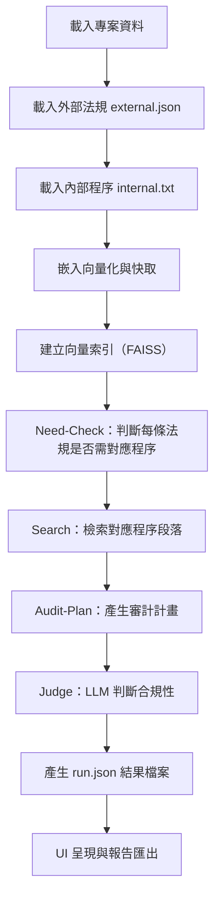

# Regulens-AI

Regulens-AI is a desktop application designed to assist with compliance analysis tasks by leveraging a Retrieval Augmented Generation (RAG) pipeline. It helps users analyze sets of control documents, procedural documents, and evidence files to assess compliance status.

## Features (Updated)

*   **Project-based workflow**: Organize your compliance assessments into projects.
*   **Three-column data input**: Clearly define paths for Controls, Procedures, and Evidence documents.
*   **Automated RAG Pipeline**: Processes your documents to find relevant information and generate compliance insights.
*   **Local Vector Store**: Utilizes FAISS for efficient similarity searches on document embeddings.
*   **LLM Integration**: Leverages Large Language Models (e.g., OpenAI GPT series) for assessment and judgment.
*   **Markdown Reporting**: Generates detailed reports of the findings.
*   **Sample Projects**: Automatically creates sample projects on first launch to demonstrate functionality.
*   **Configurable Settings**: Adjust OpenAI API key, embedding/LLM models, and other pipeline parameters through a settings dialog.
*   **Theme Support**: Multiple UI themes including Light, Dark, and Dracula themes.
*   **Multi-language Support**: Traditional Chinese and English interface.

## Quick Start

### Option 1: Using Pre-built Executable (Recommended)

1. **Download the latest release** from the releases page
2. **Extract the ZIP file** to your desired location
3. **Run `RegulensAI.exe`** directly - no installation required!

### Option 2: Development Setup

1.  **Create a virtual environment and install dependencies**:
    ```bash
    # Create a virtual environment
    python -m venv .venv

    # Activate the virtual environment
    # On macOS and Linux:
    source .venv/bin/activate
    # On Windows:
    .\.venv\Scripts\activate

    # Install dependencies
    pip install -r requirements.txt
    ```

2.  **Configure Settings**:
    *   On the first launch, the application will create sample projects.
    *   Before running any analysis, open the **Settings dialog** (File > Settings...).
    *   You **must** configure your **OpenAI API Key**.
    *   Review and set the desired **Embedding Model** and **LLM Model**. Other parameters can also be adjusted.

3.  **Run the application**:
    ```bash
    # Method 1: Using the entry point script
    python run_app.py
    
    # Method 2: Direct module execution
    python -m app.main
    ```

## Building with PyInstaller

### Prerequisites

1. **Install PyInstaller**:
   ```bash
   pip install pyinstaller
   ```

2. **Ensure all dependencies are installed**:
   ```bash
   pip install -r requirements.txt
   ```

### Building the Executable

1. **Use the provided build scripts** (recommended):
   ```bash
   # Windows
   build.bat
   
   # Linux/macOS
   chmod +x build.sh
   ./build.sh
   ```

2. **Use the provided spec file** (manual):
   ```bash
   pyinstaller --clean regulens-ai.spec
   ```

3. **Or generate a new spec file**:
   ```bash
   pyinstaller --onefile --windowed --icon=assets/icons/icon.ico --name=RegulensAI run_app.py
   ```

### Build Output

After successful build, you'll find:
- **Executable**: `dist/RegulensAI.exe`
- **Build files**: `build/` directory (can be deleted)
- **Spec file**: `regulens-ai.spec` (configuration file)

### External Files and Dependencies

The PyInstaller build includes the following external files:

#### Required Assets (automatically included):
- `assets/` - All theme files, icons, and fonts
- `config_default.yaml` - Default configuration
- `sample_data/` - Sample project data

#### Runtime Dependencies:
- **PySide6** - Qt GUI framework
- **OpenAI** - API client for LLM integration
- **FAISS** - Vector similarity search
- **Pandas** - Data manipulation
- **NumPy** - Numerical computing
- **Pydantic** - Data validation
- **Loguru** - Logging
- **PyYAML** - YAML configuration
- **WeasyPrint** - PDF generation
- **LangChain** - LLM orchestration
- **Tiktoken** - Token counting
- **Requests** - HTTP client
- **Aiohttp** - Async HTTP client
- **SQLAlchemy** - Database ORM
- **Tqdm** - Progress bars
- **Tenacity** - Retry logic
- **Markdown** - Markdown processing
- **LXML** - XML/HTML processing
- **Pillow** - Image processing
- **FontTools** - Font handling

#### Excluded Modules:
- `tkinter` - Not needed (using PySide6)
- `matplotlib` - Not used
- `scipy` - Not used
- `IPython` - Development only
- `jupyter` - Development only
- `pytest` - Testing only
- `unittest` - Testing only
- `venv` - Virtual environment files

### Troubleshooting Build Issues

1. **Missing `pydoc` module error**:
   - This is already fixed in the spec file
   - If you encounter this, ensure `pydoc` is not in the excludes list

2. **QSS themes not loading**:
   - Ensure `assets/` directory is included in the build
   - Check that theme files exist in `assets/themes/`

3. **Fonts not loading**:
   - Ensure `assets/fonts/` directory is included
   - Verify font files are present

4. **Icons not displaying**:
   - Check `assets/icons/` directory inclusion
   - Verify icon files exist

## Sample Projects

Regulens-AI includes sample projects in the `sample_data/` directory to demonstrate the application's capabilities. These samples show both compliant and non-compliant scenarios for regulatory analysis.

**Directory Structure for Sample Data (`sample_data/`)**:

*   **Sample 2: 符合規範Demo (Compliant Demo)**
    *   Purpose: Demonstrates a compliant scenario where internal procedures fully meet external regulatory requirements. Shows how proper documentation and procedures align with regulatory controls.
    *   Files:
        *   `sample2_符合規範Demo/external_regulations/external.json` - External regulatory requirements (資通安全管理辦法)
        *   `sample2_符合規範Demo/procedures/internal.txt` - Internal procedures that fully comply with regulations
        *   `sample2_符合規範Demo/procedures/internal.txt.meta.json` - Metadata for the procedure file

*   **Sample 3: 不符合規範Demo (Non-Compliant Demo)**
    *   Purpose: Illustrates a non-compliant scenario where internal procedures do not fully meet external regulatory requirements. Shows gaps between regulatory controls and actual implementation.
    *   Files:
        *   `sample3_不符合規範Demo/external_regulations/external.json` - External regulatory requirements (same as compliant demo)
        *   `sample3_不符合規範Demo/procedures/internal.txt` - Internal procedures with compliance gaps
        *   `sample3_不符合規範Demo/procedures/internal.txt.meta.json` - Metadata for the procedure file

### Sample Content Overview

**External Regulations (external.json)**:
- Contains regulatory controls from "資通安全管理辦法"
- Control C001: Event classification (4 levels)
- Control C002: Security personnel requirements (2 persons within 1 year)

**Compliant Procedures (sample2)**:
- Complete event response procedures covering all 4 levels
- Proper security personnel configuration (2 persons as required)
- Comprehensive documentation and timelines

**Non-Compliant Procedures (sample3)**:
- Incomplete event response procedures (missing level 4)
- Insufficient security personnel configuration (only 1 person)
- Incomplete documentation and timelines

These samples demonstrate how the application can identify compliance gaps and provide detailed analysis of regulatory alignment.

## Configuration

### Settings File Location

- **Windows**: `%APPDATA%\regulens-ai\settings.json`
- **macOS**: `~/Library/Application Support/regulens-ai/settings.json`
- **Linux**: `~/.config/regulens-ai/settings.json`

### Key Configuration Options

- **OpenAI API Key**: Required for LLM functionality
- **Theme**: Choose from Light, Dark, Dracula, or System
- **Language**: Traditional Chinese (zh) or English (en)
- **Embedding Model**: Default is `text-embedding-3-large`
- **LLM Model**: Default is `gpt-4o`

## Running Tests

The project uses `pytest`. To execute the test suite locally (ensure development dependencies are installed):

```bash
pytest
```

## Contributing

See [CONTRIBUTING.md](CONTRIBUTING.md) for guidelines. This project is released under the [MIT License](LICENSE).

## Project Structure

-   `app/`: Contains the core application modules, including the UI, pipeline logic, and data models.
-   `assets/`: Stores icons, fonts, and theme files.
-   `config_default.yaml`: Provides default application settings. These can be overridden via the in-app Settings Dialog, which are then stored in a user-specific configuration file.
-   `docs/`: Contains technical specification documents.
-   `tests/`: Contains automated tests for the application.
-   `sample_data/`: Contains sample projects demonstrating compliant and non-compliant scenarios.
-   `run_app.py`: Entry point script for PyInstaller builds.
-   `regulens-ai.spec`: PyInstaller configuration file.
-   `build.bat`: Windows build script for easy PyInstaller packaging.
-   `build.sh`: Linux/macOS build script for easy PyInstaller packaging.
-   `requirements.txt`: Python dependencies including PyInstaller.
-   `~/regulens-ai/cache/`: **User-specific directory** for caching embeddings and other pipeline artifacts. Not part of the repository.
-   `~/.config/regulens-ai/projects.json`: **User-specific file** storing the list of user-created projects. Not part of the repository.

The design document in `docs/TechSpec.md` describes the planned GUI and full feature set, though some aspects may have evolved.

## Cache 機制（快取）

Regulens-AI 會將部分中間結果快取在本機，以加速重複運算與減少 API 花費。

- **快取目錄**：
  - Windows: `%APPDATA%/regulens-ai/cache/`
  - macOS: `~/Library/Application Support/regulens-ai/cache/`
  - Linux: `~/.local/share/regulens-ai/cache/`

- **快取內容**：
  - 向量嵌入（embeddings）：每份文件的向量化結果，避免重複送出同一份文件到 OpenAI。
  - 向量索引（index）：FAISS 建立的向量索引檔案。
  - LLM 回應快取：部分 LLM 查詢結果（如有啟用）。
  - 臨時檔案：pipeline 執行過程中的中繼資料。

- **快取自動管理**：
  - pipeline 執行時會自動檢查快取是否存在，若有則直接載入，否則重新計算並寫入快取。
  - 使用者可手動刪除 cache 目錄，系統會自動重建。

---

## Pipeline 流程

Regulens-AI 的 pipeline 採用多步驟設計，結合 RAG（Retrieval Augmented Generation）與自動審查。



### 主要步驟說明

1. **載入專案資料**：讀取專案設定、外部法規（external.json）、內部程序（internal.txt）。
2. **嵌入向量化與快取**：將所有法規條文與程序段落送至 OpenAI 產生向量，並快取於 cache 目錄。
3. **建立向量索引（FAISS）**：建立高效的向量索引，支援後續檢索。
4. **Need-Check**：由 LLM 判斷每條法規是否需要對應程序（如「僅政策宣示」可略過）。
5. **Search**：針對需對應的法規，檢索最相關的程序段落。
6. **Audit-Plan**：產生審計計畫，列出每條法規需檢查的程序與重點。
7. **Judge**：由 LLM 判斷每條法規與程序的合規性，給出合格/不合格/建議。
8. **產生 run.json 結果檔案**：將所有分析結果儲存於 run.json，供 UI 呈現與報告匯出。

---

## How to Use（基本操作流程）

1. 啟動程式（可直接執行 exe，或於命令列執行 `python run_app.py`）
2. 首次啟動會自動建立範例專案，可直接點選左側專案體驗分析流程
3. 建立新專案：
   - 點選「新增專案」按鈕
   - 選擇外部法規（external.json）與內部程序（internal.txt）
   - 按下「開始比對」或「執行分析」
4. 分析完成後，點選專案可檢視合規性結果、審計計畫、詳細報告
5. 可於「設定」中切換主題、語言、API Key 等

---

## Configuration（設定細節）

- **OpenAI API Key**：必填，請至 [OpenAI API Keys](https://platform.openai.com/account/api-keys) 取得並填入。
- **Embedding Model**：嵌入模型，預設為 `text-embedding-3-large`，可依需求調整。
- **LLM Model**：大語言模型，預設為 `gpt-4o`，可依需求調整。
- **Theme**：介面主題，可選擇 `light`、`dark`、`dracula` 或 `system`。
- **Language**：介面語言，可選擇 `en`（英文）或 `zh`（繁體中文），於設定中切換。

---

## Exporting Reports（報告匯出/結果說明）

- 分析完成後，可於專案頁面匯出 Markdown 或 PDF 報告
- 匯出內容包含：
  - 合規性摘要
  - 審計計畫
  - 詳細比對紀錄
- `run.json` 為所有分析結果的原始資料，可供進階分析或自訂報表

---

## FAQ（常見問題）

- **Q: OpenAI API Key 無效怎麼辦？**
  - A: 請確認 Key 是否正確、餘額是否足夠，並於設定中重新輸入。
- **Q: cache 目錄能否刪除？**
  - A: 可以，系統會自動重建，但首次分析會較慢。
- **Q: run.json 找不到或結果顯示空白？**
  - A: 請確認 sample_data 是否正確複製到用戶資料夾，或重新建立專案再執行分析。
- **Q: 如何切換介面語言？**
  - A: 進入「設定」選擇語言（en/zh），重啟程式即可。
- **Q: 如何切換主題？**
  - A: 進入「設定」選擇主題（light/dark/dracula/system），立即生效。
- **Q: 匯出報告格式有哪些？**
  - A: 支援 Markdown 與 PDF 兩種格式。
- **Q: 可以自訂 sample 或測試自己的資料嗎？**
  - A: 可以，建立新專案時選擇自己的 external.json 與 internal.txt 即可。
- **Q: PyInstaller 打包後 embedding 報 Unknown encoding cl100k_base？**
  - A: 請參考「PyInstaller 打包 tiktoken 完整指引」章節，務必加上 tiktoken_ext 與 tiktoken_ext.openai_public 兩個 hidden-imports，並確認 venv 有這兩個模組。

## PyInstaller 打包 tiktoken 完整指引

### 問題現象與成因

- 打包後 exe 執行時出現：
  ```
  Failed to get tiktoken encoding 'cl100k_base': Unknown encoding cl100k_base.
  tiktoken version: 0.9.0 (are you on latest?)
  ValueError: Unknown encoding cl100k_base.
  ```
- 這會導致 embedding（向量化）完全失敗，RAG pipeline、證據檢索等功能無法運作。
- 成因：tiktoken encoding 註冊在 plugin（tiktoken_ext.openai_public），PyInstaller 不會自動打包這些外掛，或 venv 安裝異常導致缺檔。

### 1. venv 檢查與正確安裝

先確認 venv 裡 tiktoken 安裝完整：

```bash
python - <<'PY'
import importlib.util, pkg_resources, sys, pathlib
print("tiktoken version =", pkg_resources.get_distribution("tiktoken").version)
print("tiktoken_ext.openai_public =", importlib.util.find_spec("tiktoken_ext.openai_public"))
print("encodings dir exists? ", pathlib.Path(importlib.util.find_spec("tiktoken").origin).parent.joinpath("encodings").is_dir())
PY
```
- `tiktoken_ext.openai_public` 必須能找到，否則：
  ```bash
  pip uninstall -y tiktoken
  pip install -U tiktoken
  ```
- encodings/ 資料夾新版不一定存在，只要 plugin 有就正常。

### 2. .spec/CLI 正確 hidden-imports 寫法

#### .spec 範例：
```python
from PyInstaller.utils.hooks import collect_submodules, collect_data_files
hiddenimports = collect_submodules('tiktoken_ext') + ['tiktoken_ext.openai_public']
datas = collect_data_files('tiktoken')
# Analysis(..., hiddenimports=hiddenimports, datas=datas, ...)
```

#### CLI 範例：
```bash
pyinstaller run_app.py --onefile \
  --hidden-import=tiktoken_ext \
  --hidden-import=tiktoken_ext.openai_public \
  --collect-data=tiktoken
```

### 3. 打包後如何驗證

- 執行 exe 並搜尋 log：
  ```
  Plugins found: ['tiktoken_ext.openai_public']
  ```
- 有這行就代表 encoding 載入成功。
- 若 `Plugins found: []`，多半是 hidden-import 拼錯或 PyInstaller 版本太舊。

### 4. 離線/自訂 cache 處理

- 若目標機器無法上網，可先在開發機下載 model 檔：
  ```bash
  python -m tiktoken.cli download --output encodings_cache
  ```
- .spec 補一句：
  ```python
  datas += [("encodings_cache", "encodings_cache")]
  ```
- 或程式碼設環境變數：
  ```python
  os.environ["TIKTOKEN_CACHE_DIR"] = os.path.join(sys._MEIPASS, "encodings_cache")
  ```

### 5. 常見陷阱與排查清單

| 狀況                                                 | 解法                                                                            |
| -------------------------------------------------- | ----------------------------------------------------------------------------- |
| `ModuleNotFoundError: blobfile…`                   | `tiktoken` 0.4-0.6 會自帶 optional blobfile；若遇到就 `pip install blobfile` 或升到 0.7+ |
| `.spec` 裡用了 `collect_data_files('tiktoken')` 但還是失敗 | 仍須 **hidden-imports 2 個外掛**；只收 data 不會註冊 encoding                             |
| 只在 arm64/mac 打包失敗                                  | 升到 PyInstaller 6.x；x86 版 hooks 有時漏掉 ctypes 動態庫                                |
| venv 裡根本沒有 `tiktoken_ext`                          | 表示 pip 感染舊快取；`pip install --no-cache-dir --force-reinstall tiktoken` 再試       |

### 一行結論

> **加上 `tiktoken_ext` 與 `tiktoken_ext.openai_public` 兩個 hidden-imports，並確定 venv 裡真的有這兩個模組後，`Unknown encoding cl100k_base` 就不會再出現。**

### 參考連結
- [tiktoken #89: PyInstaller打包後找不到encoding](https://github.com/openai/tiktoken/issues/89)
- [tiktoken #221: cl100k_base encoding missing after build](https://github.com/openai/tiktoken/issues/221)
- [Knowledge Oasis: pyinstaller-tiktoken-unknown-encoding-cl100k_base-error](https://knowledge-oasis.net/fix/pyinstaller-tiktoken-unknown-encoding-cl100k_base-error/)
- [StackOverflow: Unknown Encoding TikToken Error in exe](https://stackoverflow.com/questions/77292954/unknown-encoding-tiktoken-error-in-exe-that-is-compiled-with-nuitka)
